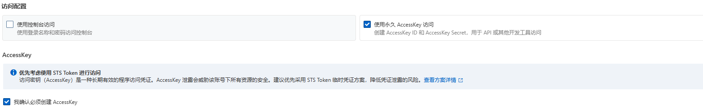
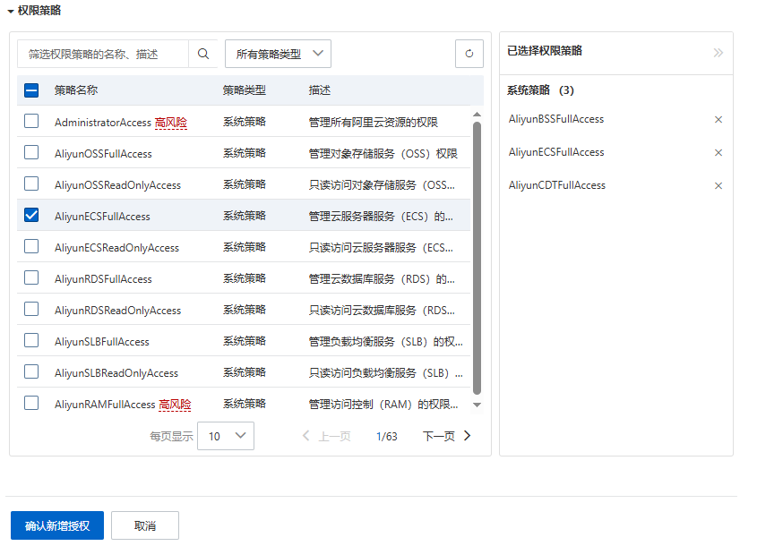
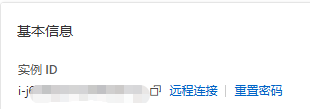
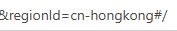

# 🛡️ AliCDT-Manager

**阿里云 CDT 流量监控与自动化管理控制台**

[](https://github.com/lillinlin/AliCDT-Manager/pkgs/container/alicdt-manager)
[](https://github.com/lillinlin/AliCDT-Manager)

</div>

---

## ✨ 功能
- 支持 AMD64 / ARM64 架构
- 多账户聚合监控，CDT 流量实时展示
- 抢占式实例保活：被回收自动拉起
- 流量熔断：超阈值自动停机
- 余额待还熔断：到设置的待还余额值自动停机
- 抢占型实例类型库存不足提醒
- 停机模式有节省停机和普通停机，默认节省，可自选择
- 定时开关机计划
- Telegram 告警通知
- 账单统计（待还款金额，国际站准确）
- 每1~2分钟自动同步数据，有特殊情况可点击立即同步

## 🚀 一键安装

```bash
bash <(curl -fsSL https://raw.githubusercontent.com/lillinlin/AliCDT-Manager/main/install.sh)
```

- docker-compose.yml 默认端口为 ports: "127.0.0.1:8000:8000" 在安装完成需要配置 Nginx 反代通过域名访问
- 如需 IP:端口 测试，可采用手动部署后手动编辑 docker-compose.yml


## 🛠 手动部署

```bash
mkdir -p /app/alicdt-manager/data && cd /app/alicdt-manager
```
```bash
echo "SECRET_KEY=$(cat /dev/urandom | tr -dc 'a-zA-Z0-9' | head -c 48)" > .env
```
```bash
curl -fsSL https://raw.githubusercontent.com/lillinlin/AliCDT-Manager/main/docker-compose.yml -o docker-compose.yml
```
```bash
docker compose up -d
```

## 🔑 添加账户变量填法
- 备注名 随意

---
- AccessKey ID 和 AccessKey Secret 获取 / 创建RAM用户及授权

在 https://ram.console.alibabacloud.com/users 创建RAM用户时 在填写随意登录名称后 

勾选   "使用永久 AccessKey 访问"  和 "我确认必须创建 AccessKey" 所得

 


- RAM用户所需授权

创建好用户后需要选中你创建的用户并新增授权

```bash
AliyunECSFullAccess
```
```bash
AliyunCDTFullAccess
```
```bash
AliyunBSSFullAccess
```
并确定新增授权



---
- 实例ID 以及 地域ID 获取


在阿里云 控制台/工作台 点击去你的实例页面 / 打开机器实例页面

- 实例ID

实例ID 就是基本信息中的实例ID

通常由 i- 开头

 


---


- 地域ID

在机器实例页面浏览器网址栏文章末段会有 "regionId=xx-xxxx#/" 中间的xx-xxxx就是 

 

比如说香港是 "regionId=cn-hongkong#/" 那么地域ID就填"cn-hongkong"

比如说日本是 "regionId=ap-northeast-1#/" 那么地域ID就填"ap-northeast-1"

比如说新加坡是 "regionId=ap-southeast-1#/" 那么地域ID就填"ap-southeast-1"

以此类推

---

其他按需填写即可


## ✨ 界面截图
  
  
  
  

## Nginx 配置示例

手动填写 
- 端口
- 域名
- Pem证书路径
- Key证书路径

```bash
nano /etc/nginx/sites-available/alicdt-manager.conf
```
- Nginx 配置示例
```bash
server {
    listen 端口 ssl;
    server_name 域名;

    ssl_certificate     Pem证书路径;
    ssl_certificate_key Key证书路径;

    ssl_protocols TLSv1.2 TLSv1.3;
    ssl_prefer_server_ciphers off;

    gzip on;
    gzip_types text/css application/json application/javascript text/javascript;
    gzip_min_length 1024;
    gzip_comp_level 6;

    keepalive_timeout 64;

    proxy_http_version 1.1;
    proxy_set_header Connection "";
    proxy_set_header Host $host;
    proxy_set_header X-Real-IP $remote_addr;
    proxy_set_header X-Forwarded-For $proxy_add_x_forwarded_for;
    proxy_set_header X-Forwarded-Proto $scheme;

    proxy_connect_timeout 10s;
    proxy_send_timeout 60s;
    proxy_read_timeout 120s;

    location ^~ /data/ {
        return 404;
    }

    location ~ (^|/)\. {
        return 404;
    }

    location / {
        proxy_pass http://alicdt_backend;
    }
}

upstream alicdt_backend {
    server 127.0.0.1:8000;
    keepalive 64;
}
```
- 填好上方配置后
```bash
ln -s /etc/nginx/sites-available/alicdt-manager.conf /etc/nginx/sites-enabled/
```
```bash
nginx -t && systemctl reload nginx
```
---

## 📋 常用命令

```bash
# 重启服务
cd /app/alicdt-manager && docker compose restart

# 更新到最新镜像
cd /app/alicdt-manager && docker compose pull && docker compose up -d

# 停止服务/卸载（保留数据）
cd /app/alicdt-manager && docker compose down

# 彻底卸载
cd /app/alicdt-manager && docker compose down && rm -rf /app/alicdt-manager
```


## Tech Stack

- Backend: Python + FastAPI + APScheduler + SQLite
- Frontend: Vue + TailwindCSS


## Nodeseek
https://www.nodeseek.com/post-737919-1
